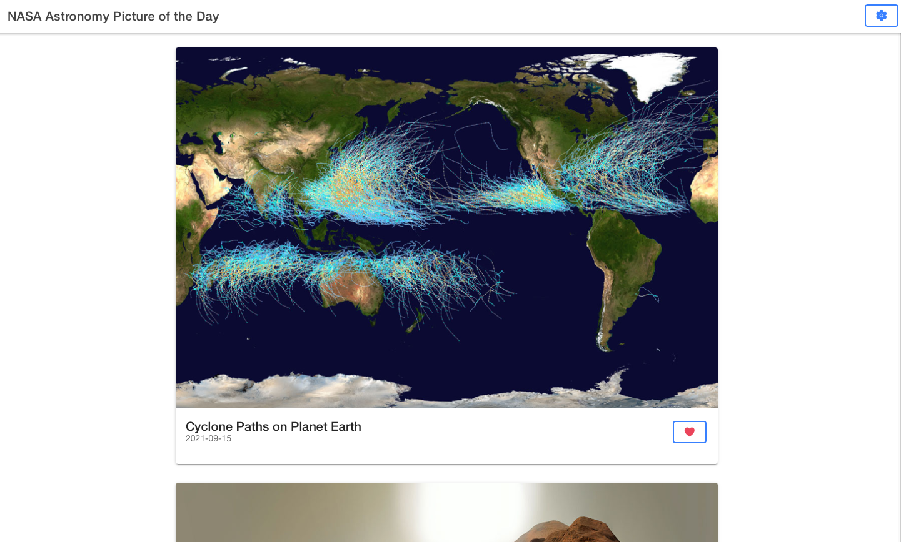

    

# NASA Space Gallery App

This repository contains the code for a webapp which shows NASA's Astronomy Picture of the Day for a selected date range. In this app, users can like images and this state will be saved for the next time the user enters the app.

[](https://app.netlify.com/sites/ratik-nasa/deploys)

Link to live demo: [nasa.ratik.me](https://nasa.ratik.me)

### Project Image



### Built With

- [Ionic React](https://ionicframework.com)

## Getting Started

#### Prerequisites

Ensure that you have the standard Node.js development tools available to use and the Yarn Package Manager installed globally.

- [Node.js](https://nodejs.org/en/)
- [Yarn](https://yarnpkg.com)
- [Ionic CLI](https://ionicframework.com/docs/cli)

#### Installation and Development

```bash
# Clone this repo
git clone https://github.com/RatikKapoor/nasa-space-gallery.git
cd nasa-space-gallery

# Install dependencies
yarn install

# Start development server
ionic serve
```

## Contributing

Pull requests are welcome. Please use semantic commit messages and branch naming conventions using [this guide](https://www.conventionalcommits.org/en/v1.0.0/). Private branches should be named using the `semantic/name/purpose` convention. For example: `docs/ratik/update-readme` signifies that Ratik is responsible for this documentation change and the purpose of the branch is to update the README. For major changes, please open an issue first to discuss what you would like to change. Please base all pull requests off of the main branch as they will be rebase merged. The linear history requirement is enforced on main.

Please make sure to update and add tests as appropriate.

## License

This repository is distributed under the MIT License.
